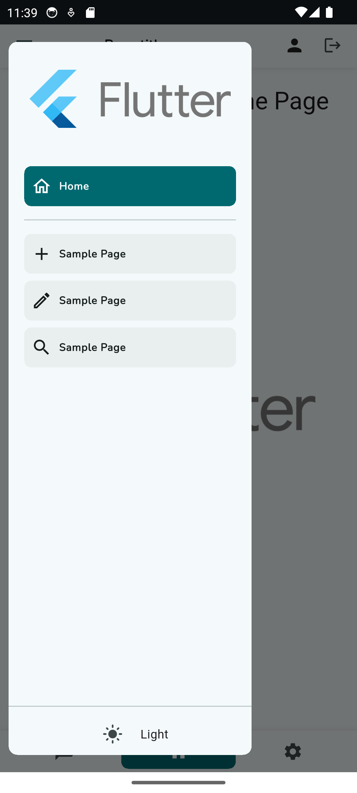
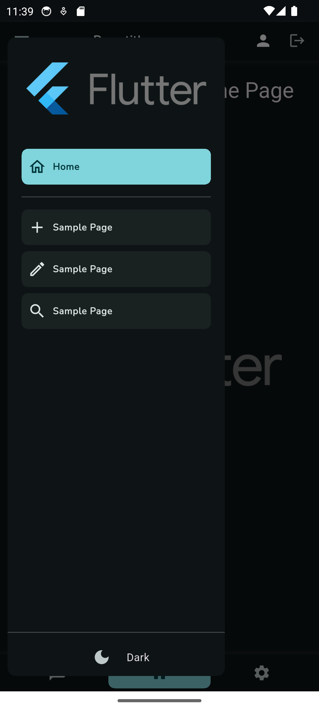
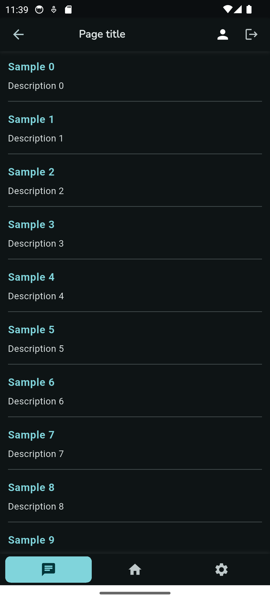
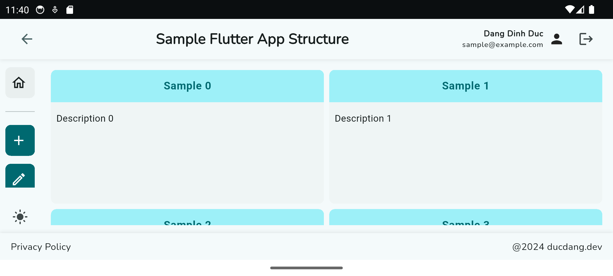
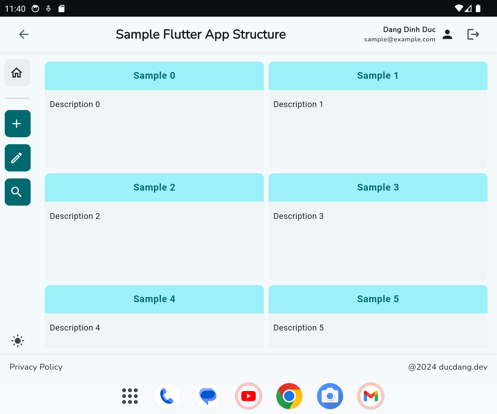
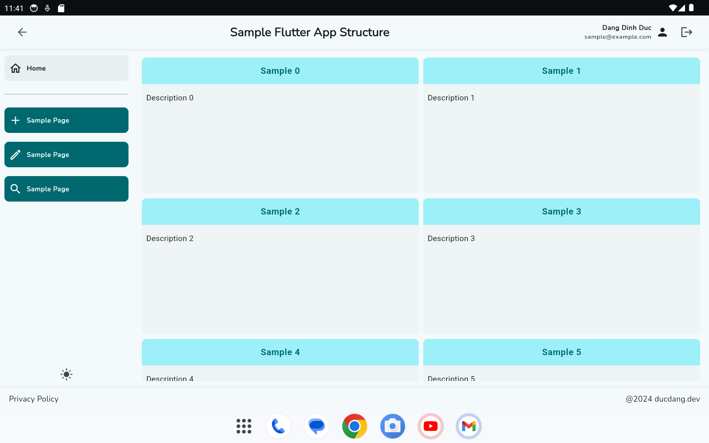
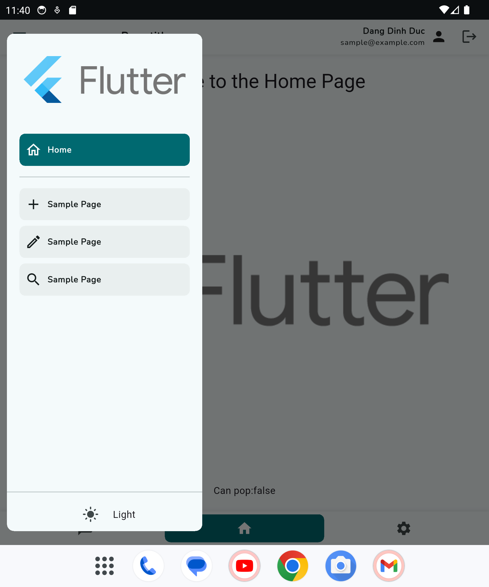

# flutter_bloc_architecture_template

A Flutter project template using the BLoC architecture.

## Sample images

<p>
  
  
  
</p>
<p>
  
  
  
  
</p>

## Getting Started

To get started with this template, follow these steps:

1. Clone the repository:

   ```
   git clone https://github.com/your_username/flutter_bloc_architecture_template.git
   ```

2. Navigate to each package in the `packages` directory:

   ```
   cd ./packages/<package_name>
   ```

3. Install the dependencies:

   ```
   flutter pub get
   ```

4. Install the dependencies of the root project:

   ```
   cd ..
   flutter pub get

   ```

5. Run the application:

- Run for development mode:

  ```
  flutter run
  ```

- Run/build for other environment mode:

  ```
    flutter (run | build) -t lib/main_<environment>.dart
  ```

- By default, if no flavor is specified, it will use the `dev` flavor. To run/build for a specific flavor, use the `--flavor` option:

  ```
    flutter (run | build) --flavor <flavor_name> -t lib/main_<environment>.dart
  ```

  For example, to run the app in production mode with the `prod` flavor:

  ```
    flutter run --flavor production -t .\lib\main_prod.dart
  ```

## Features

- BLoC architecture
- Modular design
- Easy to customize
- Material Design 3
- Using [go_router](https://pub.dev/packages/go_router) for navigation
- Multilanguage support (using [flutter_localizations](https://pub.dev/packages/flutter_localizations))
- Dynamic theming & dark mode support
- Responsive design
- Apply canonical design principles for responsive layouts. [Learn more](https://m3.material.io/foundations/layout/canonical-layouts/overview)
- Using Dio for networking. [Learn more](https://pub.dev/packages/dio)

### Common Folder Structure applied for either package or main project

```
lib/
├── I10n                          //contains all the localization files
│   ├── locale_file.arb
│   └── ...
├── src
│   ├── common/                   //contains all the common parts and utilities such as routers, constants, enum, dependencies injection
│   │   ├── constants.dart
│   │   ├── enums.dart
│   │   ├── di_config.dart
│   │   ├── common.dart           //the consolidated file for common utilities, usually export all the others parts of whole folder
│   │   └── ...
│   ├── components/               //contains all the reusable UI components, widgets, and styles
│   │   ├── component_1.dart
│   │   ├── component_2.dart
│   │   ├── component_3.dart
│   │   ├── components.dart       //the consolidated file for all components/widgets, usually export all the others components/widgets of whole folder
│   │   └── ...
│   ├── repositories/             //contains all the repositories to manage the data layer
│   │   ├── repository_1.dart
│   │   ├── repository_2.dart
│   │   ├── repository_3.dart
│   │   ├── repositories.dart       //the consolidated file for all repositories, usually export all the others repositories of whole folder
│   │   └── ...
│   ├── services/                   //contains all the services to service the business logic or api call
│   │   ├── service_1.dart
│   │   ├── service_2.dart
│   │   ├── service_3.dart
│   │   ├── services.dart       //the consolidated file for all services, usually export all the others services of whole folder
│   │   └── ...
│   ├── pages/                   //contains all the pages/screens/widgets of a specific module/package
│   │   ├── page_1.dart
│   │   ├── page_2.dart
│   │   ├── page_3.dart
│   │   ├── pages.dart       //the consolidated file for all pages/screens/widgets, usually export all the others pages/screens/widgets of whole folder
│   │   └── ...
│   ├── localization/
│   │   ├── localization.dart         //generated files by flutter_localizations
│   │   └── ...
└── main.dart                     //the entry point of the application
```

## Main Components

### Layouts & responsie

All the common widgets are located in the `app_core` package under the `components` folder. The main widgets are:

- `AdaptiveLayout`: A widget that adapts its layout based on the screen size.

```dart
  AdaptiveLayout(
    padding: 0.0,
    bottomNavigation: const AdaptiveLayoutConfig(compactScreen: AppBottomNavigator(), expandedScreen: AppFooter()),
    drawer: const AdaptiveLayoutConfig(compactScreen: AppDrawer(), mediumScreen: AppDrawer()),
    topNavigation:
        showTopNavigation
            ? AdaptiveLayoutConfig(
              inAnimation:
                  (child, animation) =>
                      SlideTransition(position: Tween<Offset>(begin: const Offset(0, -1), end: Offset.zero).animate(animation), child: child),
              outAnimation:
                  (child, animation) =>
                      SlideTransition(position: Tween<Offset>(begin: Offset.zero, end: const Offset(0, -1)).animate(animation), child: child),
              expandedScreen: LargeHeader(showMenuButton: false, onBack: onBack),
              compactScreen: CompactHeader(onBack: onBack),
            )
            : null,
    leftNavigation: AdaptiveLayoutConfig(
      inAnimation:
          (child, animation) => SlideTransition(position: Tween<Offset>(begin: const Offset(-1, 0), end: Offset.zero).animate(animation), child: child),
      outAnimation:
          (child, animation) => SlideTransition(position: Tween<Offset>(begin: Offset.zero, end: const Offset(-1, 0)).animate(animation), child: child),
      compactScreen: const SizedBox(),
      expandedScreen: Column(
        spacing: 8.0,
        mainAxisAlignment: MainAxisAlignment.center,
        children: [
          Expanded(child: const AppMenuRail()),
          BlocBuilder<SettingsCubit, SettingsState>(
            builder: (context, state) {
              var isDark = state is SettingsLoaded && state.themeSettings.themeMode == ThemeMode.dark;
              return IconButton(
                icon: Icon(isDark ? Icons.dark_mode : Icons.light_mode, color: Theme.of(context).colorScheme.onSurfaceVariant),
                onPressed: () {
                  context.read<SettingsCubit>().toggleTheme();
                },
              );
            },
          ),
        ],
      ),
    ),
    body: body != null ? AdaptiveLayoutConfig(compactScreen: body!) : bodyConfig!,
  )
```

- `LayoutConfig`: A class that defines the layout configuration for different screen sizes.

- `AppListView`: A widget that displays a list of items with different layouts based on the screen size.

```dart
  AppListView(
    gapConfig: LayoutConfig(compactScreen: 16.0, mediumScreen: 32.0),
    children: [
      AppTextField(
        label: "Email",
        onChanged: (value) => context.read<LoginCubit>().changeUser(value),
        onEditingComplete: () {
          context.read<LoginCubit>().changeUser(state.email.value);
        },
        errorText: !state.email.isPure
            ? (state.email.error == EmailValidationError.empty
                ? "Please input email."
                : state.email.error == EmailValidationError.invalid
                    ? "Invalid email."
                    : null)
            : null,
      ),
      AppTextField(
        label: "Password",
        value: state.password.value,
        obscureText: true,
        onChanged: (value) => context.read<LoginCubit>().changePassword(value),
        onEditingComplete: () {
          context.read<LoginCubit>().changePassword(state.password.value);
        },
        errorText: !state.password.isPure
            ? state.password.error == PasswordValidationError.empty
                ? "Please input password."
                : null
            : null,
      ),
      AppButton(
        width: double.infinity,
        text: "Login",
        height: 50,
        type: "primary",
        onPressed: state.isValid
            ? () {
                context.read<LoginCubit>().login();
              }
            : null,
      ),
    ],
  )

```

- `ResponsiveWidget`: A widget that displays different widgets based on the screen size.

```dart
  ResponsiveWidget(
    compactScreen: AppListView(
      children: [
        ...state.data.map(
          (item) => Column(
            spacing: 6.0,
            crossAxisAlignment: CrossAxisAlignment.start,
            children: [
              AppText(
                text: item.name,
                textAlign: TextAlign.start,
                style: Theme.of(context).textTheme.bodyLarge!.copyWith(color: Theme.of(context).colorScheme.primary, fontWeight: FontWeight.bold),
              ),
              AppText(
                text: item.description,
                maxLines: 3,
                style: Theme.of(context).textTheme.bodyMedium!.copyWith(color: Theme.of(context).colorScheme.onSurface),
              ),
              Divider(),
            ],
          ),
        ),
        //load more button
        state.loading
            ? Center(child: const CircularProgressIndicator())
            : state.hasMore
            ? TextButton(
              onPressed: () {
                context.read<SampleBlocPageCubit>().loadData(loadMore: true);
              },
              child: const Text('Load More'),
            )
            : const SizedBox(),
      ],
    ),
    expandedScreen: GridView.builder(
      gridDelegate: SliverGridDelegateWithFixedCrossAxisCount(crossAxisCount: 2, childAspectRatio: 2),
      cacheExtent: 100,
      itemCount: state.hasMore ? state.data.length + 1 : state.data.length,
      itemBuilder: (context, index) {
        if (state.data.isEmpty) {
          return const SizedBox();
        }
        //if has more
        if (state.hasMore && index == state.data.length) {
          context.read<SampleBlocPageCubit>().loadData(loadMore: true);
          return const Center(child: CircularProgressIndicator());
        }
        final item = state.data[index];
        return Card(
          shape: RoundedRectangleBorder(borderRadius: BorderRadius.circular(8.0)),
          child: SizedBox(
            height: 200,
            child: Column(
              spacing: 6.0,
              crossAxisAlignment: CrossAxisAlignment.start,
              children: [
                Container(
                  width: double.infinity,
                  padding: const EdgeInsets.all(12.0),
                  decoration: BoxDecoration(
                    color: Theme.of(context).colorScheme.primaryContainer,
                    borderRadius: const BorderRadius.only(topLeft: Radius.circular(8.0), topRight: Radius.circular(8.0)),
                  ),
                  child: AppText(
                    text: item.name,
                    textAlign: TextAlign.start,
                    style: Theme.of(context).textTheme.bodyLarge!.copyWith(color: Theme.of(context).colorScheme.primary, fontWeight: FontWeight.bold),
                  ),
                ),
                Padding(
                  padding: const EdgeInsets.all(8.0),
                  child: AppText(
                    text: item.description,
                    maxLines: 3,
                    style: Theme.of(context).textTheme.bodyMedium!.copyWith(color: Theme.of(context).colorScheme.onSurface),
                  ),
                ),
              ],
            ),
          ),
        );
      },
    ),
  )

```

### Services

All the services are located in the `app_core` package under the `services` folder. The main services are:

- `HttpService`: A service that provides network connectivity status.
- `SecureStorageService`: A service that provides secure storage for sensitive data.

## Configuration

### Change the app name & flavor name

To change the app name and flavor name, you need to update the following files:

- for Android:
  - `android\app\build.gradle.kts`, update the productFlavors section
  ```dart
   productFlavors {
        create("staging") {
            dimension = "default"
            resValue(
                type = "string",
                name = "app_name",
                value = "BLoCTemplate STG")
            applicationIdSuffix = ".staging"
        }
        create("dev") {
            dimension = "default"
            resValue(
                type = "string",
                name = "app_name",
                value = "BLoCTemplate DEV")
            applicationIdSuffix = ".dev"
        }
        create("production") {
            dimension = "default"
            resValue(
                type = "string",
                name = "app_name",
                value = "BLoCTemplate")
            // No suffix for production
        }
    }
  ```

### Change the localization settings & update the localization files

To change the localization settings, you need to update the following files, maybe also need to update the localization files in the corresponding packages:

- `lib/l10n/app_en.arb`, update the localization strings
- `lib/l10n/app_es.arb`, update the localization strings

For global settings, change the file `I10n/l10n.dart` in the main project or in each package.

Then, run the following command to generate the localization files:

```
flutter gen-l10n
```

### Change the package name

To change the package app name, using the package `change_app_package_name`.
Add the package to `dev_dependencies` in your `pubspec.yaml` file:

```
dev_dependencies:
  change_app_package_name: ^1.4.0
```

or run the command

```
flutter pub add --dev change_app_package_name
```

Then, run the following command to change the package name:

```
dart run change_app_package_name:main com.new.package.name
```

Refer to the [documentation](https://pub.dev/packages/change_app_package_name) for more information.

### Change the app launcher icon

To change the app launcher icon, you can use the `flutter_launcher_icons` package. Add the package to your `pubspec.yaml` file:

```
dev_dependencies:
  flutter_launcher_icons: ^0.9.2
```

or run the command

```
flutter pub add --dev flutter_launcher_icons
```

Then, configure the package in your `app_launcher_icons.yaml` file:

```
flutter_launcher_icons:
  android: true
  ios: true
  image_path: "assets/icon/app_icon.png"
```

Finally, run the following command to generate the app icons:

```
dart run flutter_launcher_icons -f app_launcher_icons.yaml
```

Refer to the [documentation](https://pub.dev/packages/flutter_launcher_icons) for more information.

### Change the splash screen

To change the splash screen, you can use the `flutter_native_splash` package. Add the package to your `pubspec.yaml` file:

```
dev_dependencies:
  flutter_native_splash: ^2.0.5
```

or run the command

```
flutter pub add --dev flutter_native_splash
```

Then, configure the package in your `app_native_splash.yaml` file:

```
flutter_native_splash:
  color: "#ffffff"
  image: assets/icon/app_icon.png
  android: true
  ios: true
```

Finally, run the following command to generate the splash screen:

```
dart run flutter_native_splash:create --path=app_native_splash.yaml
```

Refer to the [documentation](https://pub.dev/packages/flutter_native_splash) for more information.
